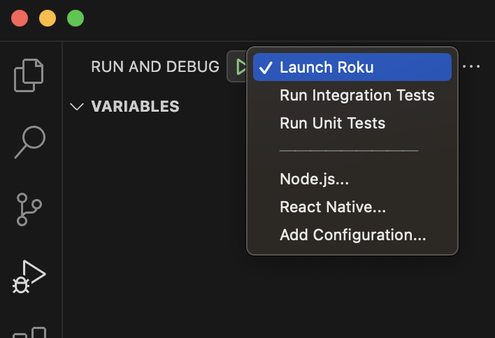

# Development

The dev channel is set up to execute unit tests, integration tests, and manual tests for Roku SDK testing.

## Requirements

The project is initialized by following these [steps](../README.md#initializing-project) and the channel can be launched correctly from VSCode.

## VSCode Launch Configuration

The VSCode project is configured to:

| Configuration |   Execution |
| ------------- | ----------- |
| **Launch Roku** | Launch the main screen to do manual testing |
| **Run Integration Tests**   | Launch the channel and run integraiont tests |
| **Run Unit Tests**   | Launch the channel and run integraiont tests |

## Unit Test

The [tests](../../../code/tests/) directory includes unit test code that has been created to run with the [Roku unit testing framework](https://github.com/rokudev/unit-testing-framework).

## Integration Test

Due to the absence of an optimal test framework for runnings integration tests with the Roku SDK, we have to develop a simple framework specifically designed for executing integration tests on the SDK's use cases.

The test framework includes the following source files:

- [ADBTestRunner.brs](../components/integration/scene/ADBTestRunner.brs)
- [TestScene.brs](../components/integration/scene/TestScene.brs)
- [TestScene.xml](../components/integration/scene/TestScene.xml)

And the test code located under [this](../components/integration/test/) directory is developered to be working with the test framework.
